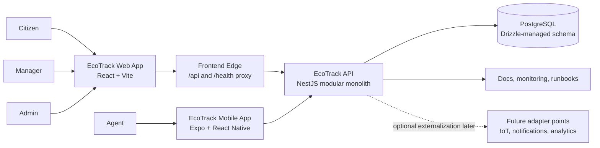
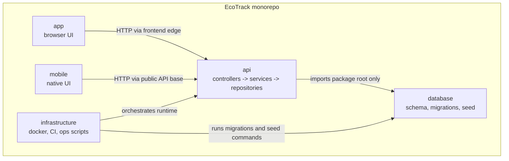
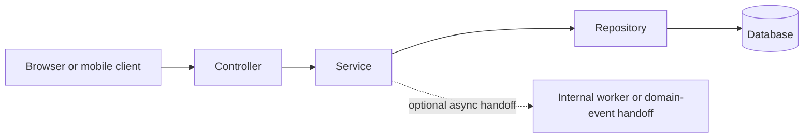

# ADR-0001: Five-Layer Architecture Contract

- Status: Accepted
- Date: 2026-02-10
- Scope: `app`, `mobile`, `api`, `database`, `infrastructure`

## Context

The repository is moving from a browser-only client plus platform stack to a browser-plus-mobile client architecture. Ownership and dependency direction must stay explicit so the new native client layer does not create cross-layer coupling, env-source drift, or hidden server-side dependencies.

## Decision

### Layer ownership

- `app`: frontend UI only (routing, views, client-side state, API calls).
- `mobile`: React Native / Expo UI only (native navigation, device capability adapters, local client state, API calls).
- `api`: NestJS domain modules under `api/src/modules/<domain>` (for example `auth`, `users`, `reports`, `collections`, `routes`, `iot`) plus shared controllers/use-cases/repositories per module.
- `database`: Drizzle schema, database client factory, migrations, seed lifecycle.
- `infrastructure`: Docker/Terraform/ops scripts for runtime orchestration.

### Dependency direction

- `app` must not import runtime code from `mobile`, `api`, `database`, or `infrastructure`.
- `mobile` must not import runtime code from `app`, `api`, `database`, or `infrastructure`.
- `api` may depend on `database`.
- `database` must never depend on `api`.
- `infrastructure` runs migration/seed commands without API bootstrap.

### Runtime behavior rules

- `app` runtime must not render TanStack Query Devtools UI in any environment.
- `app` runtime must not render manual in-app debug/testing panels.
- Browser-facing app runtimes proxy `/api` and `/health` at the frontend edge, and that frontend edge is the canonical public API origin for browser traffic.
- Local/native browser traffic enters through the Vite frontend edge on `http://localhost:5173`; the API process keeps `API_PORT=3001` for direct local diagnostics only.
- Docker browser traffic enters through the frontend container on `http://localhost:3000`; the backend keeps `API_PORT=3001` on the internal Docker network only.
- Public API docs and examples should prefer the browser-facing edge origin or edge-relative `/api` paths instead of hardcoding a direct backend diagnostics port.
- Native mobile runtimes do not use the Vite edge proxy; they call the public API origin configured by `EXPO_PUBLIC_API_BASE_URL`.
- The mobile layer is adapted from the Expo Router starter currently referenced as `poemapp`, but starter code is only a shell: demo auth, storage, and navigation flows must be remapped to EcoTrack platform APIs and roles.
- Mobile visual styling is centralized under `mobile/src/theme` plus shared `mobile/src/components` surfaces so light/dark theme changes happen once and new screens inherit the same design contract.
- Controllers in `api` must not execute Drizzle queries directly.
- Data access path: `controller -> service -> repository -> database`.
- Mobile/browser client data path must stay explicit: `screen -> client/service -> API`.
- `database` is the source of truth for schema, migration, and seed commands.
- Consumers of `ecotrack-database` must import only from the package root entrypoint (`database/index.ts`).
- Domain controllers/services in `api` must not import `drizzle-orm` or `ecotrack-database` directly.
- The current `api` runtime remains a modular monolith backed by one shared database.
- Shared-database rule: each `api` module owns its repository writes and table access, even when the PostgreSQL instance is shared.
- Cross-module coordination in `api` must use narrow application contracts (service ports/facades), not another module's repositories or direct table writes.
- Shared database usage does not relax module ownership: table sharing is allowed only through the owning module's service contract.

### Environment ownership rules

- Local/native runtime source: root `.env` plus `app/.env.local` (`VITE_*` only) and `mobile/.env.local` (`EXPO_PUBLIC_*` only).
- Docker runtime source: `infrastructure/environments/.env.docker`.
- Deployed runtime source: secret-manager injection; committed files are templates only.
- Canonical keys:
  - `DATABASE_URL`
  - `API_PORT`
  - `API_BASE_URL`
  - `VITE_API_BASE_URL`
  - `EXPO_PUBLIC_API_BASE_URL`
- Canonical database name in templates: `ticketdb`.

## Visual Views

### System context

This view reflects the current deployment contract: browser traffic reaches the API through the frontend edge, while the mobile app calls the API directly.

### Monorepo runtime containers

The diagram keeps the five-layer contract visible: UI layers call the API over HTTP, the API owns business flow, and database access stays behind repository boundaries.

### API write path

This is the required backend dependency direction for request-time behavior and future monolith worker extensions.

## Enforcement

- Lint blocks forbidden cross-layer imports across browser, mobile, and platform layers.
- CI/CD gates run architecture lint, migration checks, build/test, and env validation in:
  - `.github/workflows/CI.yaml` (`CI Integration`)
  - `.github/workflows/CD.yml` (`CD Deployment`)
- Frontend env policy checks fail on non-`VITE_*` keys in browser env files and non-`EXPO_PUBLIC_*` keys in mobile env files.

## Consequences

- Layer ownership is explicit and testable.
- Env-source ambiguity is removed across browser, native mobile, local, docker, and deploy workflows.
- Regression risk shifts from runtime surprises to CI failures.

